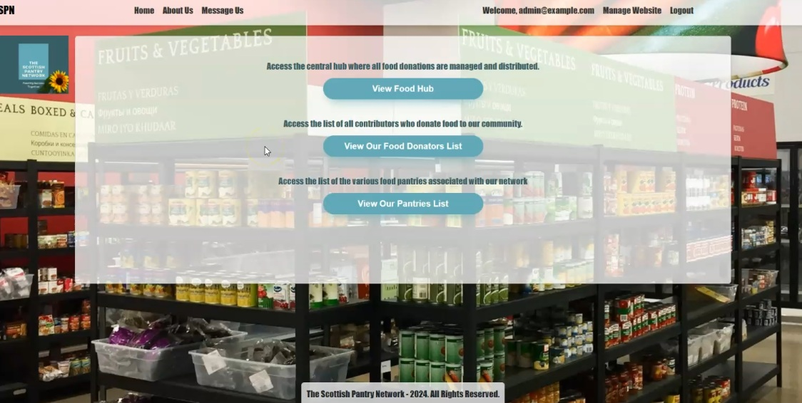
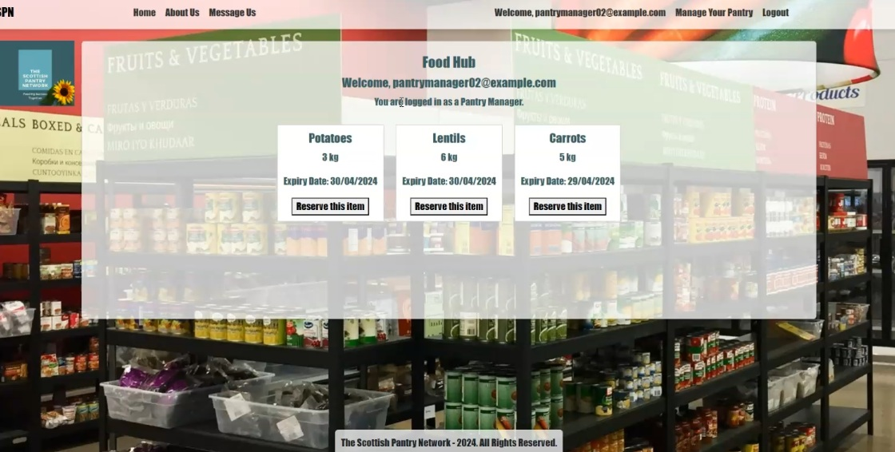

# TSPN Web Application

## Overview

TSPN is a website designed to connect food donators and food pantries. It allows growers to list available food, pantry managers to visualize and reserve those items, and admins to oversee and facilitate the entire process.

## Technology Stack

This application was developed using the following technologies:

* **Backend Framework**: Node.js with Express
* **Database**: NeDB (a file-based NoSQL database)
* **Templating Engine**: Handlebars

## Features

- **Growers**: Post available food items to the Food Hub's inventory.
- **Pantry Managers**: Browse and reserved listed food items. Upon collection, they can remove the items from the inventory to maintain an up-to-date list.
- **Repo Managers**: Oversee the repository of food items, with the ability to remove items if needed.
- **Admins**: Perform user account management, establish pantry manager profiles, and maintain overall functionality of pantries. Admins also manage communications by handling messages sent within the platform.

## Security

- **JWT (JSON Web Tokens)**: Used to transmit information between parties as a JSON object, enhancing security and ensuring that each request to the server is accompanied by a valid token that is verified for authenticity.
- **Bcrypt**: Utilized for hashing passwords, providing a secure way to store user credentials and prevent unauthorized access.

## Registration and Access

- **New Grower Registration**: Users can register a new grower profile via the registration page. The profile will remain pending until validated by an administrator.
- **Admin Validation**: Administrators can review new grower registrations and allow them to interact with the website

### Installation

- Clone the repository
- Navigate to the cloned directory
- Install NPM packages by typing "npm install"
- Start the application by typing "npm start"

## How to use the website

To access the web application, use the following credentials for different user roles:

- **Admin**: username: admin@example.com; password: adminPassword
- **Grower**: username: grower@example.com; password: growerPassword
- **Pantry Manager**: username: pantryManager01@example.com; password: pantryManagerPassword
- **Repo Manager**: username: repoManager01@example.com; password: repoManagerPassword